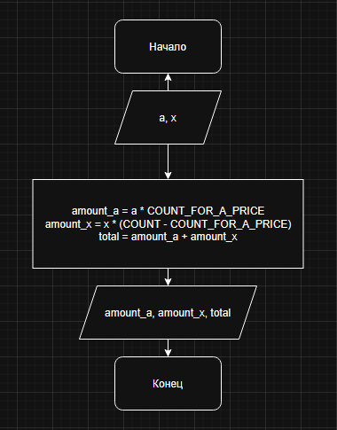

# Домашнее задание к работе 2

## Условие задачи
Мальчик, продающий на улице газеты, зарабатывает а руб. на продаже первых 75 газет. На каждой из остальных проданных газет он зарабатывает по х руб. Напишите программу, которая выведет на дисплей заработок мальчика, если он продаст 133 газеты.

## 1. Алгоритм и блок-схема

### Алгоритм
1. **Начало**
2. Объявить константы:
   - `COUNT_FOR_A_PRICE` = 75 - количество товаров, для которых применяется цена a.
   - `COUNT` = 133 — общее количество товаров.
3. Задать исходные данные:
   - `a` — цена (руб.), которая применяется для перых 75 товаров.
   - `x` — цена (руб.), которая применяется для всех остальных товаров после 75-ой.
4. Вычислить заработок за первые 75 товаров:
   - `amount_a` = `a` * `COUNT_FOR_A_PRICE`
5. Вычислить заработок за последующие товары после 75-ого:
   - `amount_x` = `x` * (`COUNT` - `COUNT_FOR_A_PRICE`)
6. Вычислить общий заработок за все покупки:
   - `total` = `amount_a` + `amount_x`
8. Вывести результаты расчетов с подстановкой всех значений в текст.
9. **Конец**

### Блок-схема



## 2. Реализация программы

```C
#include <stdio.h>
#include <locale.h>


void main() {
	setlocale(LC_ALL, "RUS");

	// Шаг 1: Объявить константы
	const int COUNT_FOR_A_PRICE = 75;
	const int COUNT = 133;

	// Шаг 2: Задать исходные данные
	int a = 100, x = 60;

	// Шаг 3: Вычислить заработок за первые 75 покупок
	int amount_a = a * COUNT_FOR_A_PRICE;

	// Шаг 4: Вычислить заработок за последующие покупки после 75-ой
	int amount_x = x * (COUNT - COUNT_FOR_A_PRICE);

	// Шаг 5: Вычислить общий заработок за все покупки
	int total = amount_a + amount_x;

	// Шаг 6: Вывести результаты расчетов с подстановкой всех значений в текст
	printf("РАСЧЕТ ЗАРАБОТКА НА ПРОДАЖЕ ГАЗЕТ\n");
	printf("================================\n\n");
	printf("УСЛОВИЯ:\n");
	printf("- Первые %d товаров продаются по цене: %d руб.\n", COUNT_FOR_A_PRICE, a);
	printf("- Последующие товары после %d-ого продаются по цене: %d руб.\n", COUNT_FOR_A_PRICE, x);

	printf("РАСЧЕТ:\n");
	printf("- Заработок за продажу первых %d товаров: %d руб. * %d шт. = %d руб.\n", COUNT_FOR_A_PRICE, a, COUNT_FOR_A_PRICE, amount_a);
	printf("- Заработок за продуже товаров после %d-ого: %d руб. * (%d шт. - %d шт.) = %d руб.\n", COUNT_FOR_A_PRICE, x, COUNT, COUNT_FOR_A_PRICE, amount_x);
	printf("================================\n");
	printf("ОБЩИЙ ЗАРАБОТОК: %d руб.\n", total);
}
```

## 3. Результаты работы программы

## 4. Информация о разработчике

Горяйнов Павел Андреевич - бИЦ-252 - Вариант 5